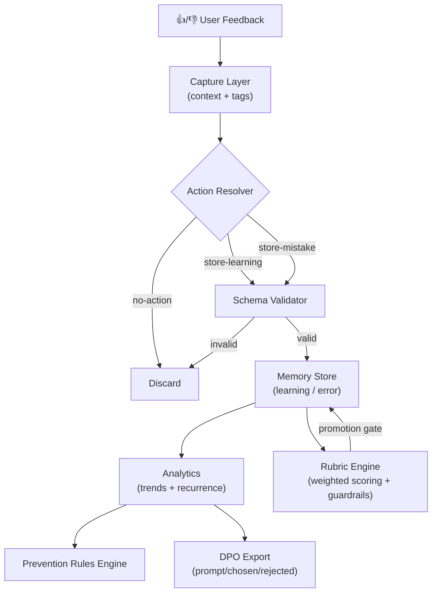
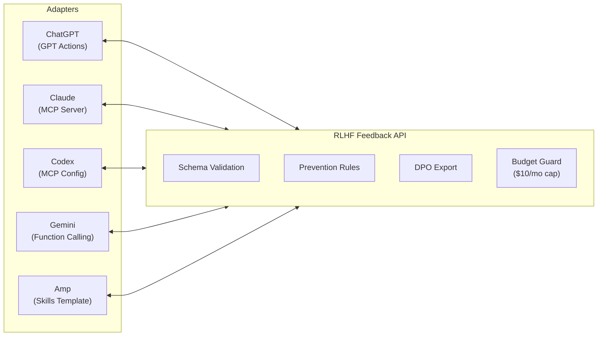

# RLHF Feedback Loop

[](https://github.com/IgorGanapolsky/rlhf-feedback-loop/actions/workflows/ci.yml)
[](https://github.com/IgorGanapolsky/rlhf-feedback-loop/actions/workflows/self-healing-monitor.yml)
[](LICENSE)
[](adapters/mcp/server-stdio.js)
[](scripts/export-dpo-pairs.js)

Production-grade RLHF operations for AI agents across ChatGPT, Claude, Gemini, Codex, and Amp.

## Quick Install

Install on any platform with a single command. Be capturing feedback in under 5 minutes.

### Universal (any platform)

```bash
npx rlhf-feedback-loop init
node .rlhf/capture-feedback.js --feedback=up --context="test"
```

### Claude Code

```bash
cp plugins/claude-skill/SKILL.md .claude/skills/rlhf-feedback.md
```

Full guide: [plugins/claude-skill/INSTALL.md](plugins/claude-skill/INSTALL.md)

### Codex

```bash
cat adapters/codex/config.toml >> ~/.codex/config.toml
```

Full guide: [plugins/codex-profile/INSTALL.md](plugins/codex-profile/INSTALL.md)

### Gemini

```bash
cp adapters/gemini/function-declarations.json .gemini/rlhf-tools.json
```

Full guide: [plugins/gemini-extension/INSTALL.md](plugins/gemini-extension/INSTALL.md)

### Amp

```bash
cp plugins/amp-skill/SKILL.md .amp/skills/rlhf-feedback.md
```

Full guide: [plugins/amp-skill/INSTALL.md](plugins/amp-skill/INSTALL.md)

### ChatGPT (GPT Actions)

Import `adapters/chatgpt/openapi.yaml` in the GPT Builder Actions editor.

Full guide: [adapters/chatgpt/INSTALL.md](adapters/chatgpt/INSTALL.md)

---

## Value Proposition

Most teams collect feedback but do not convert it into reliable behavior change.
This project gives you a working loop:

1. Capture thumbs up/down with context.
2. Score outcomes with weighted rubrics and objective guardrails.
3. Promote only schema-valid, rubric-eligible memories.
4. Generate prevention rules from repeated mistakes and failed rubric dimensions.
5. Export DPO-ready preference pairs with rubric deltas.
6. Construct bounded context packs (constructor/loader/evaluator).
7. Reuse the same core through API + MCP wrappers.
8. Route intents through policy bundles with human checkpoints on high-risk actions.

## Pricing

| Plan | Price | What you get |
|------|-------|-------------|
| **Open Source** | $0 forever | Full source, self-hosted, MIT license, 314+ tests, 5-platform plugins |
| **Cloud Pro** | $49/mo | Hosted HTTPS API on Railway, provisioned API key on payment, usage metering, email support |

Get Cloud Pro: see the [landing page](docs/landing-page.html) or go straight to Stripe Checkout.

---

## Quick Start

```bash
cp .env.example .env
npm test
npm run prove:adapters
npm run prove:automation
npm run start:api
```

Set `RLHF_API_KEY` before running the API (or explicitly set `RLHF_ALLOW_INSECURE=true` for isolated local testing only).

Capture feedback:

```bash
node .claude/scripts/feedback/capture-feedback.js \
  --feedback=down \
  --context="Claimed done without test evidence" \
  --what-went-wrong="No proof attached" \
  --what-to-change="Always run tests and include output" \
  --tags="verification,testing"
```

## Integration Adapters

- ChatGPT Actions: `adapters/chatgpt/openapi.yaml`
- Claude MCP: `adapters/claude/.mcp.json`
- Codex MCP: `adapters/codex/config.toml`
- Gemini tools: `adapters/gemini/function-declarations.json`
- Amp skill: `adapters/amp/skills/rlhf-feedback/SKILL.md`

## API Surface

- `POST /v1/feedback/capture`
- `GET /v1/feedback/stats`
- `GET /v1/intents/catalog`
- `POST /v1/intents/plan`
- `GET /v1/feedback/summary`
- `POST /v1/feedback/rules`
- `POST /v1/dpo/export`
- `POST /v1/context/construct`
- `POST /v1/context/evaluate`
- `GET /v1/context/provenance`

Spec: `openapi/openapi.yaml`

## Versioning

- Package/runtime release version: `package.json`
- API contract version: `openapi/openapi.yaml`
- MCP server protocol version: `adapters/mcp/server-stdio.js` `serverInfo.version`

## ContextFS

The repo includes a file-system context substrate for multi-agent memory orchestration:
- Constructor: relevance-ranked context pack assembly
- Loader: strict `maxItems` + `maxChars` budgeting
- Evaluator: outcome/provenance logging for improvement loops

Docs: [docs/CONTEXTFS.md](docs/CONTEXTFS.md)

## MCP Policy Profiles

Use least-privilege MCP profiles based on runtime risk:

- `default`: full local toolset
- `readonly`: read-heavy operations
- `locked`: summary-only constrained mode

Config: [config/mcp-allowlists.json](config/mcp-allowlists.json)

## Rubric Engine

Rubric config: `config/rubrics/default-v1.json`

- Weighted criteria scoring (`1-5`)
- Multi-judge disagreement detection
- Objective guardrail checks (`testsPassed`, `pathSafety`, `budgetCompliant`)
- Promotion gate blocks positive memory writes on unsafe/high-disagreement signals

## Intent Router

Versioned orchestration bundles define intent-to-action plans and checkpoint policy:

- Bundle configs: `config/policy-bundles/*.json`
- CLI list: `npm run intents:list`
- CLI plan: `npm run intents:plan`

The router marks high-risk intents as `checkpoint_required` unless explicitly approved.
Details: [docs/INTENT_ROUTER.md](docs/INTENT_ROUTER.md)

## Autonomous GitOps

The repo now ships with PR-gated autonomous operations:

- `CI` (`.github/workflows/ci.yml`): required quality gate (`npm test`, adapter proof, automation proof)
- `Agent PR Auto-Merge` (`.github/workflows/agent-automerge.yml`): auto-merges eligible agent branches (`claude/*`, `codex/*`, `auto/*`, `agent/*`) after required checks pass
- `Dependabot Auto-Merge` (`.github/workflows/dependabot-automerge.yml`): auto-approves and merges safe dependency updates after required checks pass
- `Self-Healing Monitor` (`.github/workflows/self-healing-monitor.yml`): scheduled health checks, auto-created alert issue on failure, remediation PR generation when fixable
- `Self-Healing Auto-Fix` (`.github/workflows/self-healing-auto-fix.yml`): scheduled safe-fix attempts that open remediation PRs
- `Merge Branch to Main` (`.github/workflows/merge-branch.yml`): manual fallback that still uses PR flow and branch protections

Required repo settings:

- `main` protected + required check(s)
- auto-merge enabled
- branch deletion on merge enabled

Secrets:

- Required: `GH_PAT` (or rely on `GITHUB_TOKEN` where permitted)
- Optional: `SENTRY_AUTH_TOKEN`, `SENTRY_DSN`
- Optional (LLM router): `LLM_GATEWAY_BASE_URL`, `LLM_GATEWAY_API_KEY`, `TETRATE_API_KEY`

Sync helper:

```bash
bash scripts/sync-gh-secrets-from-env.sh IgorGanapolsky/rlhf-feedback-loop
```

## Architecture

### RLHF Feedback Loop



### Plugin Topology



### PaperBanana (high-fidelity PNG)

Generate richer architecture visuals with a budget guard:

```bash
npm run diagrams:paperbanana
npm run budget:status
```

Docs: [docs/PAPERBANANA.md](docs/PAPERBANANA.md)
Verification evidence: [docs/VERIFICATION_EVIDENCE.md](docs/VERIFICATION_EVIDENCE.md)
Compatibility proof artifacts: [proof/compatibility/report.md](proof/compatibility/report.md), [proof/compatibility/report.json](proof/compatibility/report.json)
Automation proof artifacts: [proof/automation/report.md](proof/automation/report.md), [proof/automation/report.json](proof/automation/report.json)

## Budget Guardrail

Default monthly cap is `$10` for paid external operations.
The local budget ledger blocks additional spend if cap would be exceeded.

## Semantic Cache (Cost + Latency)

Context pack construction now supports semantic cache reuse for similar queries:

- token-overlap (Jaccard) similarity gate
- TTL-bound cache entries
- full provenance (`context_pack_cache_hit`)

Environment toggles:

- `RLHF_SEMANTIC_CACHE_ENABLED=true|false` (default `true`)
- `RLHF_SEMANTIC_CACHE_THRESHOLD=0.7`
- `RLHF_SEMANTIC_CACHE_TTL_SECONDS=86400`

This directly reduces repeated retrieval/LLM context assembly work and improves response latency under budget constraints.

## Optional Tetrate Router

Not required for core local RLHF logic.
Recommended only when routing paid LLM calls (PaperBanana, external judges, hosted control-plane features):

- centralized provider routing
- price/fallback control
- unified usage observability

## Commercialization

- OSS core for adoption
- Hosted control plane for teams
- Enterprise support and compliance features

See:

- [docs/PACKAGING_AND_SALES_PLAN.md](docs/PACKAGING_AND_SALES_PLAN.md)
- [docs/PLATFORM_RESEARCH_2026-03-03.md](docs/PLATFORM_RESEARCH_2026-03-03.md)
- [docs/PLUGIN_DISTRIBUTION.md](docs/PLUGIN_DISTRIBUTION.md)
- [docs/AUTONOMOUS_GITOPS.md](docs/AUTONOMOUS_GITOPS.md)
